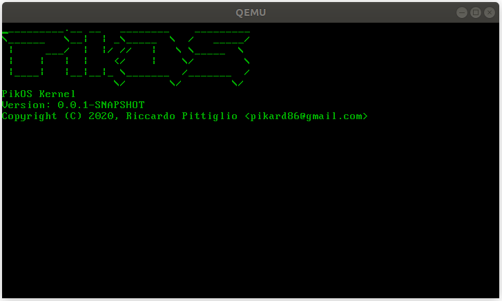

# PikOS

Seed for Kernel development based on [OS dev Bare Bones](https://wiki.osdev.org/Bare_Bones)



### Quikstart

```sh
make init
make build 
make run
```


### Install dependencies
Installs the dependencies and builds a cross compiler version gcc 7.5.0 available on `$HOME/opt/cros`

```sh 
make init
```
 
**[NOTE] depends on apt to install dependencies**

```
bison
flex
libgmp3-dev
libmpc-dev
libmpfr-dev
libcloog-isl-dev
libisl-dev
texinfo
xorriso
qemu-system-x86
```
## Build 
Build the kernel and generates the iso image under `target/picos.iso`

`make build`

## Clean
`make clean`

## To run on quemu 
`make run`

## To burn kernel image on usb dev/sdb
`make burn`
